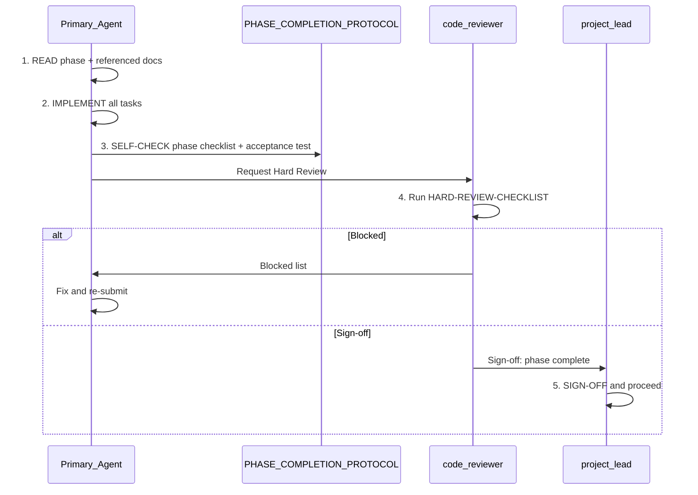

# Etmam 2.0 — Multi-Agent Implementation Plan

This plan is derived only from the context folder and repo docs. All phase names, agents, and workflow steps are cited from [docs/WORKFLOW.md](docs/WORKFLOW.md), [docs/AGENT-ASSIGNMENTS.md](docs/AGENT-ASSIGNMENTS.md), [docs/PHASE-COMPLETION-PROTOCOL.md](docs/PHASE-COMPLETION-PROTOCOL.md), and IMPLEMENTATION.md in context.

---

## 1. Multi-Agent Orchestration Workflow (from docs)

Every phase must follow this 5-step workflow. No exceptions.

| Step           | Who                                   | What (source: WORKFLOW.md)                                                                                                                                    |
| -------------- | ------------------------------------- | ------------------------------------------------------------------------------------------------------------------------------------------------------------- |
| 1. Read        | Implementer                           | Read phase in IMPLEMENTATION.md + referenced docs (BACKEND, FRONTEND, TECH-STACK, PRD; for AI/extraction phases also TENDER-STRUCTURE-v3.0-VERIFIED.md). Flag doc conflicts.                                                   |
| 2. Implement   | Primary Agent                         | Implement every task; create all files; no silent skips. Follow BACKEND/FRONTEND/TECH-STACK.                                                                  |
| 3. Self-check  | Implementer                           | Run phase checklist in [docs/PHASE-COMPLETION-PROTOCOL.md](docs/PHASE-COMPLETION-PROTOCOL.md); run Acceptance Test from IMPLEMENTATION.md; fix every failure. |
| 4. Hard review | **code-reviewer** (never implementer) | Run [docs/HARD-REVIEW-CHECKLIST.md](docs/HARD-REVIEW-CHECKLIST.md). Output "Sign-off: phase complete" or "Blocked: [list]".                                   |
| 5. Sign-off    | You (Hammad) or project-lead          | Confirm Hard Review passed; mark phase complete; proceed to next phase.                                                                                       |

**Rule:** If the reviewer returns Blocked, the phase is not complete. Fix the list and re-run Hard Review.

---

## 2. Current State (from repo)

- **Phase 1.1 (Project scaffolding):** Complete. Signed off per [docs/PHASE-1.1-CHECKLIST-RESULT.md](docs/PHASE-1.1-CHECKLIST-RESULT.md).
- **Phase 1.2 (Database schema):** Complete for 8 tables. Migration in [supabase/migrations/20260206120000_initial_schema.sql](supabase/migrations/20260206120000_initial_schema.sql). Context BACKEND.md defines **pipeline_stages** and **pipeline_entries**; the repo migration does not include them yet. For Phase 2.3, add a migration that creates these two tables from BACKEND.md (or extend the initial migration). See [docs/PHASE-1.2-CHECKLIST-RESULT.md](docs/PHASE-1.2-CHECKLIST-RESULT.md).

**Next phase to execute:** Phase 1.3 — Authentication.

**Tech stack (no exceptions):** Next.js 16+ use **proxy.ts** only for route protection — do not create middleware.ts. Use **@supabase/ssr** (createServerClient / createBrowserClient) only — do not use @supabase/auth-helpers-nextjs. Context IMPLEMENTATION.md and BACKEND.md have been updated to match. See [docs/ARCHITECTURE.md](docs/ARCHITECTURE.md) and [docs/GOTCHA-TECH-STACK-VERIFICATION.md](docs/GOTCHA-TECH-STACK-VERIFICATION.md).

---

## 3. Phase Sequence and Agent Assignments

Agent matrix is from [docs/AGENT-ASSIGNMENTS.md](docs/AGENT-ASSIGNMENTS.md). Hard Reviewer is code-reviewer unless noted.

| Phase                           | Primary Agent     | Backup            | Hard Reviewer |
| ------------------------------- | ----------------- | ----------------- | ------------- |
| 1.1 Scaffolding                 | project-lead      | senior-full-stack | code-reviewer |
| 1.2 Database schema             | senior-backend    | senior-full-stack | code-reviewer |
| 1.3 Auth flow                   | senior-full-stack | senior-backend    | code-reviewer |
| 1.4 Tender upload & list        | senior-full-stack | senior-backend    | code-reviewer |
| 2.1 AI provider setup           | senior-backend    | prompt-engineer   | code-reviewer |
| 2.2 Analysis Server Action & UI | senior-full-stack | senior-backend    | code-reviewer |
| 2.3 CRM pipeline board          | senior-frontend   | senior-full-stack | code-reviewer |
| 3.1 Bug fixes (Day 2 demo)      | senior-full-stack | —                 | qa-engineer   |
| 3.2 Dashboard page              | senior-frontend   | senior-full-stack | code-reviewer |
| 3.3 Settings page               | senior-full-stack | senior-frontend   | code-reviewer |
| 3.4 Visual polish               | art-director      | senior-frontend   | code-reviewer |
| 3.5 Documentation               | tech-writer       | project-lead      | project-lead  |
| 3.6 Demo prep                   | YOU (Hammad)      | —                 | —             |

---

## 4. Implementation Plan by Phase (Execution Order)

Phases are listed in the order they appear in IMPLEMENTATION.md. For each phase: prerequisites, task summary, and workflow checkpoint. Full task lists and acceptance tests are in IMPLEMENTATION.md; checklists (where they exist) are in PHASE-COMPLETION-PROTOCOL.

---

### Phase 1.3 — Authentication (NEXT)

**Objective:** Register, login, logout; protected dashboard routes; profile auto-created.

**Prerequisites:** Phase 1.1 and 1.2 complete (done). Supabase clients and proxy in place.

**Tasks (summary):** LoginForm, RegisterForm, Server Actions (login, register, logout), wire route protection (proxy), Header with user + logout. Reference: IMPLEMENTATION.md Phase 1.3.

**Checkpoint:** Run Phase 1.3 checklist (if present in PHASE-COMPLETION-PROTOCOL; else use IMPLEMENTATION acceptance test as checklist). Then Hard Review (code-reviewer). Sign-off before 1.4.

**Note:** IMPLEMENTATION says "Wire up proxy"; use existing **proxy.ts** for protection.

---

### Phase 1.4 — Tender Upload & List

**Objective:** Upload CSV/Excel, parse, validate, save tenders; list page with sortable table and empty state.

**Prerequisites:** Phase 1.3 complete. DB has `tenders` table and RLS.

**Tasks (summary):** TenderUpload (drag-drop, parse with PapaParse/xlsx, preview, validate), csv-parser utility, uploadTenders Server Action, TenderTable (columns, sort, status badge, row click), Tenders list page (Server Component), Zod schemas. Reference: IMPLEMENTATION.md Phase 1.4.

**Checkpoint:** Self-check against phase scope and acceptance test; Hard Review; Sign-off.

**Risky area:** CSV parsing with Arabic; test early (IMPLEMENTATION Risk Register).

---

### Phase 2.1 — AI Provider Setup

**Objective:** Unified AI provider (Gemini + Groq), analysis prompt, parser; env-driven provider switch.

**Prerequisites:** Phase 1.4 complete. Env: AI_PROVIDER, GEMINI_API_KEY, GROQ_API_KEY.

**Tasks (summary):** AI provider factory (lib/ai/provider.ts), Gemini provider, Groq provider, analysis prompt (lib/ai/prompts.ts), AI response parser (lib/ai/parser.ts). Reference: IMPLEMENTATION.md Phase 2.1; TECH-STACK for models and temp. For section-targeted extraction prompts use **docs/context/TENDER-STRUCTURE-v3.0-VERIFIED.md** (12-section Etimad template) only.

**Checkpoint:** Self-check + Hard Review. Mock/stub for no keys required (HARD-REVIEW-CHECKLIST item 6).

---

### Phase 2.2 — Analysis Server Action & UI

**Objective:** analyzeTender (and bulk) Server Action, save analysis, and full analysis UI on tender detail.

**Prerequisites:** Phase 2.1 complete. DB: `evaluations` (and tender status) per BACKEND.md.

**Tasks (summary):** analyzeTender / analyzeBulk Server Actions, ScoreGauge, ScoreBreakdown, EvidenceQuotes, RecommendationCard, AnalysisPanel, AnalyzeButton, Tender Detail page layout. Reference: IMPLEMENTATION.md Phase 2.2.

**Doc alignment:** IMPLEMENTATION.md Phase 2.2 comments say "Save analysis to tender_analyses" and "evidence to analysis_evidence". BACKEND.md has **evaluations** (one row per tender, criteria_scores JSONB). Implementation must use **evaluations** and BACKEND schema; do not create tender_analyses/analysis_evidence unless BACKEND is updated.

**Checkpoint:** Self-check + Hard Review; confirm all acceptance test points.

---

### Phase 2.3 — CRM Pipeline Board

**Objective:** 6-column pipeline board, move tender between stages, Push to CRM simulation with field mapping.

**Prerequisites:** Phase 2.2 complete. Context BACKEND.md defines pipeline_stages and pipeline_entries; repo migration currently has only 8 tables. Add a migration for these two tables from BACKEND.md before or during Phase 2.3. FRONTEND.md defines 6 stages (new, scored, approved, pushed, won, lost).

**Tasks (summary):** PipelineBoard, PipelineCard, PipelineColumn, pipeline Server Actions (moveToPipeline, pushToCRM), PushToCRM component, CRMFieldMapping display, pipeline page. Reference: IMPLEMENTATION.md Phase 2.3.

**Checkpoint:** Self-check + Hard Review. Required CRM fields per IMPLEMENTATION (entity_name, title, number, deadline, value, score, recommendation).

---

### Phase 3.1 — Bug Fixes (Day 2 Demo)

**Objective:** Fix issues found during Day 2 demo run.

**Prerequisites:** Day 2 checkpoint completed and bugs recorded.

**Tasks:** Fix list from demo (auth loops, CSV edge cases, AI parsing, RLS, layout). Primary: senior-full-stack. Hard Reviewer: **qa-engineer**.

---

### Phase 3.2 — Dashboard Page

**Objective:** Dashboard with real stats (StatCard, StatsRow, RecentTenders, PipelineSummary, ScoreDistribution).

**Prerequisites:** Phase 3.1 done. Data from tenders and evaluations.

**Tasks (summary):** StatCard, StatsRow (4 cards), RecentTenders, PipelineSummary, ScoreDistribution (CSS bars), dashboard page assembly. Reference: IMPLEMENTATION.md Phase 3.2.

**Checkpoint:** Self-check + Hard Review.

---

### Phase 3.3 — Settings Page

**Objective:** AI provider toggle, scoring weights (5 criteria, sum 100), persistence; settings page assembly.

**Prerequisites:** Phase 3.2 done. Stores and AI flow wired.

**Tasks (summary):** AIProviderConfig, ScoringWeights (sliders/inputs, live preview, reset), tabbed Settings page. Reference: IMPLEMENTATION.md Phase 3.3. Criteria names and weights must align with BACKEND.md (alignment, profitability, timeline, competition, strategic_value) if docs are aligned; otherwise document choice.

**Checkpoint:** Self-check + Hard Review.

---

### Phase 3.4 — Visual Polish

**Objective:** Sidebar, table, score gauge, toasts, empty states, theme consistency (navy/gold).

**Prerequisites:** Phase 3.3 done.

**Tasks (summary):** Sidebar polish, table polish, score gauge animation, toasts, empty states, theme check. Reference: IMPLEMENTATION.md Phase 3.4. Agent: art-director + senior-frontend.

**Checkpoint:** Self-check + Hard Review.

---

### Landing Page (in IMPLEMENTATION as second "Phase 3.3")

**Objective:** Public landing at `/` (presentation-style), 6 sections; authenticated users redirect to /dashboard.

**Prerequisites:** Layout and auth redirect in place.

**Tasks (summary):** Root page logic (auth → /dashboard, else landing), HeroSection, ProblemStatement, SolutionOverview, FeatureHighlights, TechStack, CTAFooter. Reference: IMPLEMENTATION.md "Phase 3.3 — Landing Page" section.

**Checkpoint:** Self-check + Hard Review.

---

### Phase 3.5 — Documentation

**Objective:** README (quick start, env table, features, tech stack, architecture, security, competition requirements), .env.example, key inline comments.

**Prerequisites:** Features implemented. Agent: tech-writer. Hard Reviewer: project-lead.

**Checkpoint:** Self-check + Hard Review.

---

### Phase 3.6 — Demo Preparation

**Objective:** Demo data, 5-minute script, rehearsal, backup plan, deploy (e.g. Vercel).

**Prerequisites:** Phase 3.5 done. Agent: YOU (Hammad); not AI.

**No Hard Review in docs;** human rehearsal and sign-off.

---

## 5. Testing and Quality Gates

- **After each phase:** Phase checklist (or IMPLEMENTATION acceptance test) must pass; then Hard Review (code-reviewer or qa-engineer per phase).
- **Build:** Every phase must leave `pnpm build` and `tsc --noEmit` passing (HARD-REVIEW-CHECKLIST item 9).
- **Day 1 checkpoint:** Auth, DB, CSV upload, layout, design tokens (IMPLEMENTATION Day 1).
- **Day 2 checkpoint:** AI analysis E2E, evidence, pipeline, CRM push (IMPLEMENTATION Day 2).
- **Day 3 checkpoint:** Dashboard, settings, polish, README, demo data, deploy (IMPLEMENTATION Day 3).

---

## 6. Risks and Doc Gaps (from docs only)

- **RLS blocking queries:** IMPLEMENTATION Risk Register. Mitigation: test every query after writing policies.
- **AI invalid JSON:** Robust parser and fallback (Phase 2.1/2.2).
- **Pipeline tables:** Context BACKEND.md defines pipeline_stages and pipeline_entries; repo migration has only 8 tables. Add a migration for these two tables for Phase 2.3 (from BACKEND.md).
- **Phase 2.2 table names:** Implement using **evaluations** (BACKEND); do not create tender_analyses/analysis_evidence unless BACKEND adds them.
- **Cut list vs P0:** IMPLEMENTATION "P0 — NEVER cut" includes Dashboard and Settings; cut list does not list them. Implementation scope follows P0.

---

## 7. How to Run a Phase (Concrete)

1. **Assign:** "You are [Primary Agent]. Read IMPLEMENTATION.md Phase X.Y and [BACKEND/FRONTEND/TECH-STACK as needed]. Implement all tasks."
2. **After implementer claims done:** "Run the phase checklist in docs/PHASE-COMPLETION-PROTOCOL.md for Phase X.Y and the acceptance test. Fix any failure."
3. **Request review:** "You are code-reviewer. Run docs/HARD-REVIEW-CHECKLIST.md on Phase X.Y. Output Sign-off or Blocked."
4. **If Blocked:** Implementer fixes list; re-run step 3.
5. **Sign-off:** You or project-lead confirm and move to next phase.

---

## 8. Gotcha Verification (plan grounded in docs)

- **Workflow steps:** Taken from [docs/WORKFLOW.md](docs/WORKFLOW.md) (Read, Implement, Self-check, Hard Review, Sign-off).
- **Agent matrix:** Taken from [docs/AGENT-ASSIGNMENTS.md](docs/AGENT-ASSIGNMENTS.md); phase list matches IMPLEMENTATION.md.
- **Phase numbers and names:** Match IMPLEMENTATION.md (Day 1: 1.1–1.4; Day 2: 2.1–2.3; Day 3: 3.1–3.6 plus Landing).
- **Current state:** From [docs/PHASE-1.1-CHECKLIST-RESULT.md](docs/PHASE-1.1-CHECKLIST-RESULT.md) and [docs/PHASE-1.2-CHECKLIST-RESULT.md](docs/PHASE-1.2-CHECKLIST-RESULT.md).
- **proxy vs middleware:** From repo [docs/ARCHITECTURE.md](docs/ARCHITECTURE.md) and PHASE-COMPLETION-PROTOCOL (proxy.ts).
- **evaluations vs tender_analyses:** BACKEND.md defines evaluations; IMPLEMENTATION Phase 2.2 text references tender_analyses — plan instructs to use evaluations and notes the doc mismatch.
- **Pipeline tables:** Context BACKEND.md defines pipeline_stages and pipeline_entries; plan states repo migration has only 8 tables and to add a migration for Phase 2.3.

No invented phases, agents, or workflow steps; all citations point to existing docs.